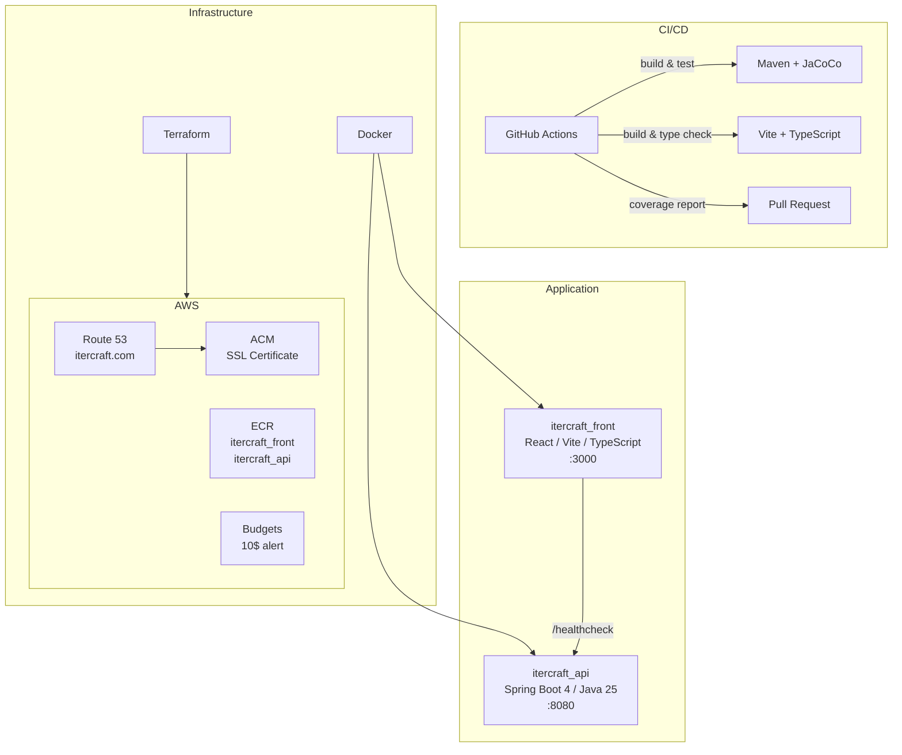

# Itercraft

## Overview

Itercraft is a cloud-native web application deployed on AWS (eu-west-1), built with a Java/Spring Boot backend, a React/TypeScript frontend, and supported by a full DevSecOps pipeline.

## Architecture



## Project Structure

```
itercraft/
├── .github/workflows/     # CI/CD pipeline (backend + frontend)
├── devsecops/
│   ├── docker/
│   │   ├── Dockerfile       # Backend (multi-stage, Java 25)
│   │   └── Dockerfile.front # Frontend (multi-stage, Nginx)
│   └── terraform/           # Infrastructure as Code
│       ├── aws_acm/         # SSL certificate (*.itercraft.com)
│       ├── aws_budget/      # Cost alert (10$/month)
│       ├── aws_ecr/         # Container registries (itercraft_api, itercraft_front)
│       ├── aws_route53/     # DNS (CNAME www + ACM validation)
│       ├── env.sh           # Environment variables (not committed)
│       └── tf.sh            # Terraform wrapper script
├── itercraft_api/           # Backend API (:8080)
│   └── src/
│       ├── main/            # Domain-Driven Design architecture
│       │   ├── domain/          # Value objects
│       │   ├── application/     # Services (interface + impl)
│       │   └── infrastructure/  # REST controllers
│       └── test/            # Unit & integration tests
└── itercraft_front/         # Frontend (:3000)
    └── src/
        ├── types/           # TypeScript interfaces
        ├── services/        # API calls
        ├── hooks/           # Custom React hooks
        ├── pages/           # Pages by feature
        ├── components/      # Reusable components
        └── utils/           # Utilities
```

## Tech Stack

| Layer          | Technology                     |
|----------------|--------------------------------|
| Backend        | Java 25, Spring Boot 4.0.2     |
| Frontend       | React, TypeScript, Vite        |
| Build          | Maven, JaCoCo, npm             |
| Infrastructure | Terraform, Docker, Nginx       |
| Cloud          | AWS (Route 53, ACM, ECR, Budgets) |
| CI/CD          | GitHub Actions                 |
| Region         | eu-west-1 (Ireland)            |

## Getting Started

### Prerequisites

- Java 25
- Node.js 25
- Maven 3.8+
- Terraform 1.x
- Docker
- AWS CLI

### Run the API locally

```bash
cd itercraft_api
mvn spring-boot:run
```

The API is available at `http://localhost:8080/healthcheck`.

### Run the frontend locally

```bash
cd itercraft_front
npm install
npm run dev
```

The frontend is available at `http://localhost:3000`.

### Run tests

```bash
# Backend
cd itercraft_api
mvn clean verify

# Frontend
cd itercraft_front
npx tsc --noEmit
```

Backend coverage report is generated in `itercraft_api/target/site/jacoco/index.html`.

### Deploy infrastructure

```bash
cd devsecops/terraform
# Configure env.sh with your credentials
./tf.sh <module> init
./tf.sh <module> apply
```

### Build Docker images

```bash
# Backend
docker build -f devsecops/docker/Dockerfile -t itercraft-api .
docker run -p 8080:8080 itercraft-api

# Frontend
docker build -f devsecops/docker/Dockerfile.front -t itercraft-front .
docker run -p 3000:3000 itercraft-front
```

## License

Proprietary - All rights reserved.
