# Itercraft

## Overview

Itercraft is a cloud-native web application deployed on AWS (eu-west-1), built with a Java/Spring Boot backend, a React/TypeScript frontend, and supported by a full DevSecOps pipeline.

## Architecture

```mermaid
graph TB
    subgraph CI/CD
        GH[GitHub Actions]
        GH -->|build & test| MVN[Maven + JaCoCo]
        GH -->|build & type check| VITE[Vite + TypeScript]
        GH -->|coverage report| PR[Pull Request]
        GH -->|dependency check| OWASP[OWASP]
        GH -->|code quality| SONAR[SonarCloud]
        GH -->|accessibility| LH[Lighthouse CI]
        GH -->|tag v*| ECR_PUSH[Push images to ECR]
        GH -->|notify| SLACK[Slack]
        SLACK -->|/infra apply| GH
        SLACK -->|/infra destroy| GH
    end

    subgraph AWS
        ECR[ECR<br/>6 repos]
        BUD[Budgets<br/>10$ alert]
        EC2[EC2 t3a.medium<br/>Ubuntu 22.04]
        EIP[Elastic IP]
        SG[Security Group<br/>Cloudflare IPs only]
        IAM[IAM Role<br/>ECR ReadOnly + SSM]
        S3[S3<br/>Terraform state]
        DDB[DynamoDB<br/>State locking]
        LAMBDA[Lambda<br/>Slack bridge]
        APIGW[API Gateway<br/>Slack webhook]
        EC2 --> EIP
        EC2 --> SG
        EC2 --> IAM
        IAM -->|pull images| ECR
        APIGW --> LAMBDA
        LAMBDA -->|workflow_dispatch| GH
    end

    subgraph Cloudflare
        CF[Cloudflare DNS<br/>itercraft.com]
        CF -->|proxy HTTPS| EIP
    end

    subgraph "Application (EC2 / docker-compose)"
        TRAEFIK[Traefik v3<br/>reverse proxy<br/>:80]
        TRAEFIK -->|www| FRONT[itercraft_front<br/>React / Vite / TypeScript]
        TRAEFIK -->|api| API[itercraft_api<br/>Spring Boot 4 / Java 25]
        TRAEFIK -->|authent| KC[Keycloak 26<br/>OAuth2/OIDC + PKCE<br/>:8180]
        TRAEFIK -->|grafana| GRAF[Grafana<br/>:3001]
        API -.-|/healthcheck| API
        FRONT -.-|/healthcheck| FRONT
        FRONT -->|auth| KC
        FRONT -->|API + CSRF| API
        FRONT -->|SSE /api/events| API
        API -->|token introspection| KC
        API -->|JPA| PG[PostgreSQL 17<br/>+ Liquibase<br/>:5432]
        API -->|analyze image| CLAUDE[Claude API<br/>Anthropic]
        API -->|WMS GetMap| MF[Météo France<br/>AROME PI]
        PROM[Prometheus<br/>:9090] -->|scrape /actuator/prometheus| API
        GRAF -->|query| PROM
        MQTT[Mosquitto<br/>MQTT Broker<br/>:8883 TLS]
        API -->|subscribe sensors/#| MQTT
    end

    subgraph IoT
        ESP32[ESP32<br/>Capteurs]
        ESP32 -->|MQTTS 8883| MQTT
    end

    subgraph Infrastructure
        TF[Terraform]
        DOCKER[Docker]
        TF --> AWS
        DOCKER --> TRAEFIK
    end
```



## Project Structure

```
itercraft/
├── .github/workflows/     # CI/CD pipeline (backend + frontend)
├── devsecops/
│   ├── docker/
│   │   ├── Dockerfile          # Backend (multi-stage, Java 25)
│   │   ├── Dockerfile.front    # Frontend (multi-stage, Nginx)
│   │   ├── Dockerfile.keycloak # Keycloak (multi-stage, realm import)
│   │   ├── Dockerfile.postgres # PostgreSQL 17 + Liquibase
│   │   ├── keycloak/
│   │   │   └── itercraft-realm.json # Realm config (clients, user, roles)
│   │   ├── prometheus/
│   │   │   └── prometheus.yml       # Scrape config (itercraft-api)
│   │   ├── grafana/
│   │   │   └── datasource.yml       # Prometheus datasource provisioning
│   │   ├── Dockerfile.prometheus    # Prometheus
│   │   ├── Dockerfile.grafana       # Grafana (port 3001)
│   │   └── postgres/
│   │       └── entrypoint-wrapper.sh # Postgres + Liquibase bootstrap
│   ├── liquibase/             # Database migrations
│   │   ├── db.changelog-master.yaml
│   │   └── changelogs/        # 001-init-schema, 002-seed-services
│   └── terraform/           # Infrastructure as Code
│       ├── aws_budget/      # Cost alert (10$/month)
│       ├── aws_ec2/         # EC2 + Elastic IP + SSM + Cloudflare DNS (Traefik + docker-compose)
│       ├── aws_ecr/         # Container registries (6 repos)
│       ├── aws_oidc_github/ # OIDC provider + IAM roles (GitHub Actions → ECR + Terraform)
│       ├── aws_backend/     # S3 bucket + DynamoDB for Terraform state (remote backend)
│       ├── aws_lambda_slack/# Lambda + API Gateway for Slack /infra command
│       ├── env.sh           # Environment variables (not committed)
│       └── tf.sh            # Terraform wrapper script
├── iot/                     # IoT / MQTT
│   └── mosquitto/           # MQTT broker configuration
│       ├── Dockerfile           # Mosquitto 2.0 with TLS
│       ├── mosquitto.conf       # Broker config (TLS 1.3, auth, ACL)
│       ├── acl.conf             # Topic-based access control
│       ├── docker-compose.yml   # Local development
│       └── scripts/             # Certificate & user management
│           ├── generate-certs.sh
│           ├── add-user.sh
│           └── generate-device-cert.sh
├── itercraft_api/           # Backend API (:8080)
│   └── src/
│       ├── main/            # Domain-Driven Design architecture
│       │   ├── domain/          # Entities, repositories, value objects
│       │   ├── application/     # Services (interface + impl)
│       │   └── infrastructure/  # REST controllers, security, DTOs
│       └── test/            # Unit & integration tests (H2)
└── itercraft_front/         # Frontend (:3000)
    └── src/
        ├── api/             # API client (subscriptions, CSRF)
        ├── auth/            # Keycloak auth provider + protected route
        ├── pages/           # Pages (home, dashboard, healthcheck)
        ├── components/      # Reusable components (Header, Footer)
        └── utils/           # Utilities
```

## Tech Stack

| Layer          | Technology                                                                              |
|----------------|-----------------------------------------------------------------------------------------|
| Backend        | Java 25, Spring Boot 4.0.2, Spring Security                                             |
| Frontend       | React, TypeScript, Vite                                                                 |
| Database       | PostgreSQL 17, Liquibase (schema migrations)                                            |
| Build          | Maven, JaCoCo, npm, Vitest                                                              |
| Analytics      | Google Analytics (GA4, après consentement uniquement)                                   |
| Accessibility  | Lighthouse CI (score ≥ 90 en CI)                                                        |
| Security       | OWASP Dependency-Check, SonarCloud, CSRF (cookie)                                       |
| Auth           | Keycloak 26 (OAuth2/OIDC, PKCE, token introspection)                                    |
| IA / Vision    | Claude API, Anthropic (analyse d'images météo)                                          |
| Real-time      | Server-Sent Events (SSE, SseEmitter)                                                    |
| IoT            | Mosquitto MQTT (TLS 1.3, password auth, ACL), ESP32                                     |
| Monitoring     | Prometheus, Grafana, Micrometer, Spring Boot Actuator                                   |
| Infrastructure | Terraform, Docker, Nginx, Traefik                                                       |
| Cloud          | AWS (ECR, EC2, Elastic IP, Budgets, SSM, S3, DynamoDB, Lambda, API Gateway), Cloudflare |
| CI/CD          | GitHub Actions, Slack ChatOps (`/infra`)                                                |
| Region         | eu-west-1 (Ireland)                                                                     |

## Getting Started

### Prerequisites

- Java 25
- Node.js 25
- Maven 3.8+
- Terraform 1.x
- Docker
- AWS CLI

### Environment Variables

The backend is configured via environment variables (with defaults for local development):

| Variable                 | Default                 | Description                            |
|--------------------------|-------------------------|----------------------------------------|
| `DB_HOST`                | `localhost`             | PostgreSQL host                        |
| `DB_PORT`                | `5432`                  | PostgreSQL port                        |
| `DB_NAME`                | `itercraft`             | Database name                          |
| `DB_USER`                | `itercraft`             | Database user                          |
| `DB_PASSWORD`            | `itercraft`             | Database password                      |
| `KEYCLOAK_URL`           | `http://localhost:8180` | Keycloak base URL                      |
| `KEYCLOAK_REALM`         | `itercraft`             | Keycloak realm                         |
| `KEYCLOAK_CLIENT_ID`     | `iterapi`               | Confidential client for introspection  |
| `KEYCLOAK_CLIENT_SECRET` | `changeme`              | Client secret                          |
| `CORS_ORIGINS`           | `http://localhost:3000` | Allowed CORS origins (comma-separated) |
| `METEOFRANCE_API_TOKEN`  | `changeme`              | Météo France API key                   |
| `ANTHROPIC_API_KEY`      | `changeme`              | Anthropic API key (Claude)             |
| `ANTHROPIC_MODEL`        | `claude-sonnet-4-20250514`  | Claude model for image analysis        |

The frontend uses a `.env` file:

| Variable              | Default                  | Description           |
|-----------------------|--------------------------|-----------------------|
| `VITE_KEYCLOAK_URL`   | `http://localhost:8180`  | Keycloak base URL     |
| `VITE_KEYCLOAK_REALM` | `itercraft`              | Keycloak realm        |
| `VITE_API_URL`        | `http://localhost:8080`  | Backend API base URL  |

### Run the API locally

Requires a running PostgreSQL (with Liquibase migrations applied) and Keycloak instance.

```bash
cd itercraft_api
mvn spring-boot:run
```

The API is available at `http://localhost:8080/healthcheck`.

### Run the frontend locally

```bash
cd itercraft_front
npm install
npm run dev
```

The frontend is available at `http://localhost:3000/healthcheck`.

### Run tests

```bash
# Backend (uses H2 in-memory database)
cd itercraft_api
mvn clean verify

# Frontend
cd itercraft_front
npx vitest run
```

Backend coverage report is generated in `itercraft_api/target/site/jacoco/index.html`.

### Deploy infrastructure

#### Required credentials

1. **AWS** : configurer `AWS_ACCESS_KEY_ID`, `AWS_SECRET_ACCESS_KEY` et `AWS_MFA_SERIAL` dans `devsecops/terraform/env.sh`
2. **Cloudflare API Token** :
   - Cloudflare Dashboard → My Profile → API Tokens → Create Token
   - Template : **Edit zone DNS**
   - Ajouter la permission : Zone → Zone Settings → Edit
   - Zone Resources : Include → itercraft.com
   - Copier le token dans `TF_VAR_cloudflare_api_token` dans `env.sh`
3. **GitHub Secrets** (pour le CI/CD) : `AWS_ACCOUNT_ID` dans les secrets de l'environment `itercraft`

#### Terraform apply

```bash
cd devsecops/terraform
# Configure env.sh with your credentials

# 1. Budget (cost alert)
./tf.sh aws_budget init && ./tf.sh aws_budget apply

# 2. ECR (container registries)
./tf.sh aws_ecr init && ./tf.sh aws_ecr apply

# 3. OIDC GitHub (IAM role for CI/CD → ECR push, no AWS keys needed)
./tf.sh aws_oidc_github init && ./tf.sh aws_oidc_github apply

# 4. EC2 + Cloudflare DNS (Elastic IP + DNS records + SSL Flexible)
./tf.sh aws_ec2 init && ./tf.sh aws_ec2 apply
```

### Deploy images (CI/CD)

Le workflow `deploy.yml` est declenche automatiquement lors d'un tag `v*` :

```bash
git tag v1.0.0
git push origin v1.0.0
```

GitHub Actions build les 6 images Docker, les tag avec la version + `latest`, et les push sur ECR.

L'authentification utilise **OIDC** (OpenID Connect) : GitHub assume un role IAM directement aupres d'AWS, sans access keys stockees dans les secrets. Le module Terraform `aws_oidc_github` cree l'identity provider et le role `github-actions-ecr-push` restreint aux tags `v*` du repo.

Seul secret GitHub requis : `AWS_ACCOUNT_ID`.

### Deploy infrastructure via Slack (ChatOps)

La stack EC2 peut être deployee ou detruite directement depuis Slack avec la commande `/infra` :

```text
/infra apply ec2    # Terraform apply sur aws_ec2
/infra destroy ec2  # Terraform destroy sur aws_ec2
/infra plan ec2     # Terraform plan (dry-run)
```

Le workflow est declenche via GitHub Actions (`terraform.yml`) et notifie le resultat dans Slack.

#### Architecture ChatOps

```text
Slack /infra command
       ↓
API Gateway (HTTPS)
       ↓
Lambda (Node.js) — verifie signature Slack, appelle GitHub API
       ↓
GitHub Actions workflow_dispatch
       ↓
Terraform apply/destroy (OIDC → AWS)
       ↓
Notification Slack (webhook)
```

#### Setup ChatOps

1. **Backend S3 + DynamoDB** (remote state + locking) :

   ```bash
   ./tf.sh aws_backend init
   ./tf.sh aws_backend apply
   ```

   Crée le bucket `itercraft-terraform-state` et la table `itercraft-terraform-locks`.

2. **Role Terraform OIDC** :

   ```bash
   ./tf.sh aws_oidc_github init
   ./tf.sh aws_oidc_github apply
   ```

   Ajoute le role `github-actions-terraform` avec permissions EC2/S3/DynamoDB.

3. **Secrets GitHub** (Settings → Environments → `itercraft`) :
   - `AWS_TERRAFORM_ROLE_ARN` : ARN du role terraform (output de aws_oidc_github)
   - `SLACK_WEBHOOK_URL` : webhook Slack Incoming Webhook pour les notifications

4. **Slack App** :
   - Créer une app sur <https://api.slack.com/apps>
   - Ajouter une Slash Command `/infra`
   - Noter le **Signing Secret** (Basic Information → App Credentials)

5. **Lambda Slack → GitHub** :

   ```bash
   ./tf.sh aws_lambda_slack init
   ./tf.sh aws_lambda_slack apply
   ```

   Variables requises (via `terraform.tfvars` ou `-var`) :
   - `github_token` : Personal Access Token (classic) avec scope `repo`
   - `slack_signing_secret` : Signing Secret de la Slack App

   Configurer l'output `slack_webhook_url` comme Request URL de la slash command `/infra`.

6. **Initialiser EC2 avec backend S3** (première fois uniquement) :
   ```bash
   cd devsecops/terraform/aws_ec2
   source ../env.sh
   terraform init \
     -backend-config="bucket=itercraft-terraform-state" \
     -backend-config="key=aws_ec2/terraform.tfstate" \
     -backend-config="region=eu-west-1" \
     -backend-config="dynamodb_table=itercraft-terraform-locks" \
     -backend-config="encrypt=true"
   ```

Ensuite, utiliser `/infra apply ec2` ou `/infra destroy ec2` depuis Slack.

### API Endpoints

| Method   | URL                                       | Auth          | Description                |
|----------|-------------------------------------------|---------------|----------------------------|
| `GET`    | `/healthcheck`                            | Public        | Health status              |
| `GET`    | `/actuator/health`                        | Public        | Actuator health            |
| `GET`    | `/actuator/prometheus`                    | Public        | Prometheus metrics         |
| `GET`    | `/api/events`                             | Public        | SSE stream (real-time)     |
| `GET`    | `/api/subscriptions`                      | Bearer        | User subscriptions + usage |
| `GET`    | `/api/services`                           | Bearer        | All available services     |
| `POST`   | `/api/subscriptions/{serviceCode}`        | Bearer + CSRF | Subscribe to a service     |
| `DELETE` | `/api/subscriptions/{serviceCode}`        | Bearer + CSRF | Unsubscribe                |
| `POST`   | `/api/subscriptions/{serviceCode}/usages` | Bearer + CSRF | Add usage                  |
| `DELETE` | `/api/subscriptions/{serviceCode}/usages` | Bearer + CSRF | Remove usage               |
| `POST`   | `/api/meteo/map`                          | Bearer + CSRF | Weather map image (PNG)    |
| `POST`   | `/api/meteo/analyze`                      | Bearer + CSRF | AI weather analysis (JSON) |

Mutation endpoints require an `X-XSRF-TOKEN` header matching the `XSRF-TOKEN` cookie.

### Build Docker images

```bash
docker build -f devsecops/docker/Dockerfile.postgres  -t itercraft-postgres .
docker build -f devsecops/docker/Dockerfile            -t itercraft-api .
docker build -f devsecops/docker/Dockerfile.front      -t itercraft-front .
docker build -f devsecops/docker/Dockerfile.keycloak    -t itercraft-keycloak .
docker build -f devsecops/docker/Dockerfile.prometheus  -t itercraft-prometheus .
docker build -f devsecops/docker/Dockerfile.grafana     -t itercraft-grafana .
```

### Run - Dev (containers on localhost)

Le backend accede aux autres services via `localhost` + port mapping Docker.
`KC_HOSTNAME=localhost` (defini dans le Dockerfile) fixe l'issuer Keycloak a `http://localhost:8180`.

```bash
# PostgreSQL
docker run -p 5432:5432 itercraft-postgres

# Keycloak
docker run -p 8180:8180 itercraft-keycloak

# Backend (sur le host, pas besoin de -e)
cd itercraft_api && mvn spring-boot:run

# Frontend
cd itercraft_front && npm run dev
```

### Run - Dev (tout en containers)

Les containers communiquent via le reseau Docker.
Le backend doit connaitre les IP ou hostnames Docker des autres services.

```bash
# Creer un reseau
docker network create itercraft

# PostgreSQL
docker run --network itercraft --name postgres -p 5432:5432 itercraft-postgres

# Keycloak (KC_HOSTNAME=localhost pour que l'issuer matche le navigateur)
docker run --network itercraft --name keycloak -p 8180:8180 itercraft-keycloak

# Backend (DB_HOST et KEYCLOAK_URL pointent vers les hostnames Docker)
docker run --network itercraft --name api -p 8080:8080 \
  -e DB_HOST=postgres \
  -e KEYCLOAK_URL=http://keycloak:8180 \
  -e CORS_ORIGINS=http://localhost:3000 \
  -e ANTHROPIC_API_KEY=<your-key> \
  itercraft-api

# Frontend
docker run --network itercraft --name front -p 3000:3000 itercraft-front

# Prometheus
docker run --network itercraft --name prometheus -p 9090:9090 itercraft-prometheus

# Grafana (admin/admin)
docker run --network itercraft --name grafana -p 3001:3001 itercraft-grafana
```

### Run - Production

```bash
docker run --network itercraft --name postgres \
  -e POSTGRES_PASSWORD=<secret> \
  itercraft-postgres

docker run --network itercraft --name keycloak \
  -e KC_HOSTNAME=authent.itercraft.com \
  -e KC_HOSTNAME_PORT=-1 \
  itercraft-keycloak

docker run --network itercraft --name api \
  -e DB_HOST=postgres \
  -e DB_PASSWORD=<secret> \
  -e KEYCLOAK_URL=http://keycloak:8180 \
  -e KEYCLOAK_CLIENT_SECRET=<secret> \
  -e CORS_ORIGINS=https://www.itercraft.com \
  itercraft-api

docker run --network itercraft --name front -p 3000:3000 itercraft-front

docker run --network itercraft --name prometheus -p 9090:9090 itercraft-prometheus

docker run --network itercraft --name grafana -p 3001:3001 itercraft-grafana
```

## IoT / MQTT Setup

Itercraft includes a secure MQTT broker (Mosquitto) for IoT device connectivity.

### Security Features

- **TLS 1.3** : All connections encrypted with modern cipher suites
- **Password Authentication** : No anonymous connections allowed
- **ACL** : Topic-based access control (devices can only publish to their own topics)
- **DNS-only** : `mqtt.itercraft.com` points directly to EC2 (no Cloudflare proxy for TCP)

### Broker Initial Setup (one-time)

```bash
cd iot/mosquitto

# 1. Generate CA and server certificates
./scripts/generate-certs.sh

# 2. Create admin user
./scripts/add-user.sh admin
# Enter a strong password when prompted

# 3. Create backend service account
./scripts/add-user.sh itercraft-backend
# Enter a strong password when prompted
```

Output files:

- `certs/ca.crt` : CA certificate (to distribute to IoT devices)
- `certs/server.crt` / `server.key` : Server TLS certificate
- `passwd` : Password file (hashed, safe to commit)

### Device Enrollment Process

#### Step 1: Generate device credentials

```bash
cd iot/mosquitto

# Create MQTT user for the device
# Convention: device-<type>-<serial>
./scripts/add-user.sh device-esp32-ABC123 "$(openssl rand -base64 24)"
```

Save the generated password securely (e.g., password manager, secrets vault).

#### Step 2: Prepare device provisioning files

Create a provisioning folder for the device:

```bash
DEVICE_ID="esp32-ABC123"
mkdir -p provisioning/$DEVICE_ID

# Copy CA certificate
cp certs/ca.crt provisioning/$DEVICE_ID/

# Create credentials file
cat > provisioning/$DEVICE_ID/mqtt_credentials.h << EOF
#ifndef MQTT_CREDENTIALS_H
#define MQTT_CREDENTIALS_H

#define MQTT_BROKER     "mqtt.itercraft.com"
#define MQTT_PORT       8883
#define MQTT_USER       "device-$DEVICE_ID"
#define MQTT_PASSWORD   "<password-from-step-1>"
#define DEVICE_ID       "$DEVICE_ID"

// CA Certificate (copy content of ca.crt)
const char* ca_cert = R"EOF(
-----BEGIN CERTIFICATE-----
<PASTE CONTENT OF ca.crt HERE>
-----END CERTIFICATE-----
)EOF";

#endif
EOF
```

#### Step 3: Flash the device

1. Open the ESP32 project in PlatformIO/Arduino IDE
2. Copy `mqtt_credentials.h` to the `src/` folder
3. Build and upload to the device
4. Monitor Serial output to verify connection

#### Step 4: Verify enrollment

```bash
# Subscribe to device topics (from server or local with mosquitto-clients)
mosquitto_sub -h mqtt.itercraft.com -p 8883 \
  --cafile certs/ca.crt \
  -u admin -P <admin-password> \
  -t "sensors/esp32-ABC123/#" -v

# Expected output when device publishes:
# sensors/esp32-ABC123/temperature 23.5
# sensors/esp32-ABC123/humidity 65.2
```

### Topic Structure & ACL

| Topic Pattern | Access | Description |
|---------------|--------|-------------|
| `sensors/<device_id>/#` | Device: write | Sensor readings (temperature, humidity, etc.) |
| `devices/<device_id>/status` | Device: write | Heartbeat, battery level, WiFi RSSI |
| `commands/<device_id>/#` | Device: read | Commands from backend (reboot, config update) |
| `broadcast/#` | All: read | Global announcements (maintenance, updates) |

**ACL enforcement**: A device `device-esp32-ABC123` can only:

- Publish to `sensors/esp32-ABC123/*` and `devices/esp32-ABC123/*`
- Subscribe to `commands/esp32-ABC123/*` and `broadcast/*`

### ESP32 Reference Implementation

```cpp
#include <WiFi.h>
#include <WiFiClientSecure.h>
#include <PubSubClient.h>
#include "mqtt_credentials.h"  // Generated during enrollment

WiFiClientSecure espClient;
PubSubClient mqtt(espClient);

void connectMQTT() {
  espClient.setCACert(ca_cert);
  mqtt.setServer(MQTT_BROKER, MQTT_PORT);
  mqtt.setCallback(onMessage);

  while (!mqtt.connected()) {
    Serial.print("MQTT connecting...");
    if (mqtt.connect(DEVICE_ID, MQTT_USER, MQTT_PASSWORD)) {
      Serial.println("connected");

      // Subscribe to commands
      char cmdTopic[64];
      snprintf(cmdTopic, sizeof(cmdTopic), "commands/%s/#", DEVICE_ID);
      mqtt.subscribe(cmdTopic);
      mqtt.subscribe("broadcast/#");

      // Publish online status
      char statusTopic[64];
      snprintf(statusTopic, sizeof(statusTopic), "devices/%s/status", DEVICE_ID);
      mqtt.publish(statusTopic, "{\"status\":\"online\"}");
    } else {
      Serial.printf("failed, rc=%d\n", mqtt.state());
      delay(5000);
    }
  }
}

void onMessage(char* topic, byte* payload, unsigned int length) {
  Serial.printf("Message on %s: %.*s\n", topic, length, payload);
  // Handle commands here
}

void publishSensor(const char* type, float value) {
  char topic[64], msg[32];
  snprintf(topic, sizeof(topic), "sensors/%s/%s", DEVICE_ID, type);
  snprintf(msg, sizeof(msg), "%.2f", value);
  mqtt.publish(topic, msg);
}

void setup() {
  Serial.begin(115200);
  WiFi.begin(WIFI_SSID, WIFI_PASSWORD);
  while (WiFi.status() != WL_CONNECTED) delay(500);
  connectMQTT();
}

void loop() {
  if (!mqtt.connected()) connectMQTT();
  mqtt.loop();

  // Example: publish temperature every 30s
  static unsigned long lastPublish = 0;
  if (millis() - lastPublish > 30000) {
    publishSensor("temperature", 23.5);
    publishSensor("humidity", 65.0);
    lastPublish = millis();
  }
}
```

### Dynamic CA Certificate Fetching

The CA certificate is automatically uploaded to S3 when Mosquitto starts. Devices can fetch it dynamically:

**URL**: `https://itercraft-mqtt-certs.s3.eu-west-1.amazonaws.com/mqtt/ca.crt`

```cpp
#include <HTTPClient.h>
#include <Preferences.h>

#define CA_CERT_URL "https://itercraft-mqtt-certs.s3.eu-west-1.amazonaws.com/mqtt/ca.crt"

Preferences prefs;
String caCert;

bool fetchCACert() {
  HTTPClient http;
  http.begin(CA_CERT_URL);
  int code = http.GET();

  if (code == 200) {
    caCert = http.getString();
    // Cache in NVS for offline use
    prefs.begin("mqtt", false);
    prefs.putString("ca_cert", caCert);
    prefs.end();
    Serial.println("CA cert fetched and cached");
    return true;
  }
  Serial.printf("Failed to fetch CA cert: %d\n", code);
  return false;
}

void loadCACert() {
  prefs.begin("mqtt", true);
  caCert = prefs.getString("ca_cert", "");
  prefs.end();

  if (caCert.isEmpty()) {
    fetchCACert();
  }
}

void setup() {
  Serial.begin(115200);
  WiFi.begin(WIFI_SSID, WIFI_PASSWORD);
  while (WiFi.status() != WL_CONNECTED) delay(500);

  loadCACert();
  espClient.setCACert(caCert.c_str());
  connectMQTT();
}
```

**Certificate refresh**: Call `fetchCACert()` periodically (e.g., daily) or when MQTT connection fails with TLS errors.

### Device Decommissioning

```bash
cd iot/mosquitto

# Remove device from password file
# (mosquitto_passwd doesn't have delete, so recreate without the device)
grep -v "^device-esp32-ABC123:" passwd > passwd.tmp && mv passwd.tmp passwd

# Restart Mosquitto to apply changes
docker restart itercraft-mosquitto
```

### Run Locally (Development)

```bash
cd iot/mosquitto
docker-compose up -d

# Test with mosquitto_pub
mosquitto_pub -h localhost -p 8883 \
  --cafile certs/ca.crt \
  -u device-esp32-test -P testpassword \
  -t "sensors/esp32-test/temperature" \
  -m "25.3"
```

### Build & Push to ECR

```bash
cd iot/mosquitto
docker build -t itercraft-mosquitto .

# Tag and push
aws ecr get-login-password --region eu-west-1 | docker login --username AWS --password-stdin <account_id>.dkr.ecr.eu-west-1.amazonaws.com
docker tag itercraft-mosquitto:latest <account_id>.dkr.ecr.eu-west-1.amazonaws.com/itercraft_mosquitto:latest
docker push <account_id>.dkr.ecr.eu-west-1.amazonaws.com/itercraft_mosquitto:latest
```

## License

Proprietary - All rights reserved.
