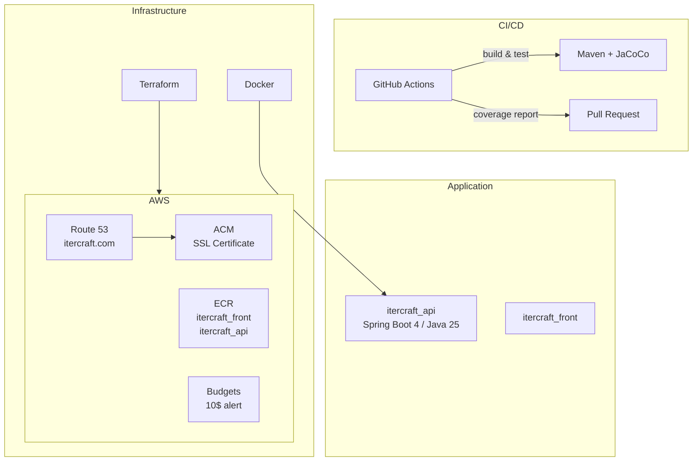

# Itercraft

## Overview

Itercraft is a cloud-native web application deployed on AWS (eu-west-1), built with a Java/Spring Boot backend and supported by a full DevSecOps pipeline.

## Architecture



## Project Structure

```
itercraft/
├── .github/workflows/     # CI/CD pipeline
├── devsecops/
│   ├── docker/            # Dockerfile (multi-stage build)
│   └── terraform/         # Infrastructure as Code
│       ├── aws_acm/       # SSL certificate (*.itercraft.com)
│       ├── aws_budget/    # Cost alert (10$/month)
│       ├── aws_ecr/       # Container registries (itercraft_api, itercraft_front)
│       ├── aws_route53/   # DNS (CNAME www + ACM validation)
│       ├── env.sh         # Environment variables (not committed)
│       └── tf.sh          # Terraform wrapper script
├── itercraft_api/         # Backend API
│   └── src/
│       ├── main/          # Domain-Driven Design architecture
│       │   ├── domain/        # Value objects
│       │   ├── application/   # Services (interface + impl)
│       │   └── infrastructure/# REST controllers
│       └── test/          # Unit & integration tests
└── itercraft_front/       # Frontend (TBD)
```

## Tech Stack

| Layer          | Technology                     |
|----------------|--------------------------------|
| Backend        | Java 25, Spring Boot 4.0.2     |
| Build          | Maven, JaCoCo                  |
| Infrastructure | Terraform, Docker              |
| Cloud          | AWS (Route 53, ACM, ECR, Budgets) |
| CI/CD          | GitHub Actions                 |
| Region         | eu-west-1 (Ireland)            |

## Getting Started

### Prerequisites

- Java 25
- Maven 3.8+
- Terraform 1.x
- Docker
- AWS CLI

### Run the API locally

```bash
cd itercraft_api
mvn spring-boot:run
```

The API is available at `http://localhost:8080/healthcheck`.

### Run tests

```bash
cd itercraft_api
mvn clean verify
```

Coverage report is generated in `itercraft_api/target/site/jacoco/index.html`.

### Deploy infrastructure

```bash
cd devsecops/terraform
# Configure env.sh with your credentials
./tf.sh <module> init
./tf.sh <module> apply
```

### Build Docker image

```bash
docker build -f devsecops/docker/Dockerfile -t itercraft-api .
docker run -p 8080:8080 itercraft-api
```

## License

Proprietary - All rights reserved.
