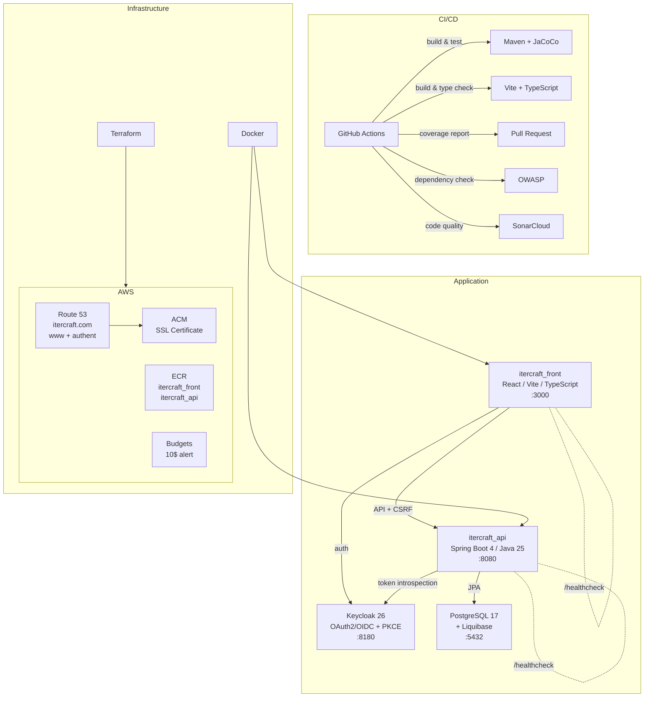

# Itercraft

## Overview

Itercraft is a cloud-native web application deployed on AWS (eu-west-1), built with a Java/Spring Boot backend, a React/TypeScript frontend, and supported by a full DevSecOps pipeline.

## Architecture



## Project Structure

```
itercraft/
├── .github/workflows/     # CI/CD pipeline (backend + frontend)
├── devsecops/
│   ├── docker/
│   │   ├── Dockerfile          # Backend (multi-stage, Java 25)
│   │   ├── Dockerfile.front    # Frontend (multi-stage, Nginx)
│   │   ├── Dockerfile.keycloak # Keycloak (multi-stage, realm import)
│   │   ├── Dockerfile.postgres # PostgreSQL 17 + Liquibase
│   │   ├── keycloak/
│   │   │   └── itercraft-realm.json # Realm config (clients, user, roles)
│   │   └── postgres/
│   │       └── entrypoint-wrapper.sh # Postgres + Liquibase bootstrap
│   ├── liquibase/             # Database migrations
│   │   ├── db.changelog-master.yaml
│   │   └── changelogs/        # 001-init-schema, 002-seed-services
│   └── terraform/           # Infrastructure as Code
│       ├── aws_acm/         # SSL certificate (*.itercraft.com)
│       ├── aws_budget/      # Cost alert (10$/month)
│       ├── aws_ecr/         # Container registries (itercraft_api, itercraft_front)
│       ├── aws_route53/     # DNS (CNAME www + authent + ACM validation)
│       ├── env.sh           # Environment variables (not committed)
│       └── tf.sh            # Terraform wrapper script
├── itercraft_api/           # Backend API (:8080)
│   └── src/
│       ├── main/            # Domain-Driven Design architecture
│       │   ├── domain/          # Entities, repositories, value objects
│       │   ├── application/     # Services (interface + impl)
│       │   └── infrastructure/  # REST controllers, security, DTOs
│       └── test/            # Unit & integration tests (H2)
└── itercraft_front/         # Frontend (:3000)
    └── src/
        ├── api/             # API client (subscriptions, CSRF)
        ├── auth/            # Keycloak auth provider + protected route
        ├── pages/           # Pages (home, dashboard, healthcheck)
        ├── components/      # Reusable components (Header, Footer)
        └── utils/           # Utilities
```

## Tech Stack

| Layer          | Technology                                            |
|----------------|-------------------------------------------------------|
| Backend        | Java 25, Spring Boot 4.0.2, Spring Security           |
| Frontend       | React, TypeScript, Vite                               |
| Database       | PostgreSQL 17, Liquibase (schema migrations)          |
| Build          | Maven, JaCoCo, npm, Vitest                            |
| Security       | OWASP Dependency-Check, SonarCloud, CSRF (cookie)     |
| Auth           | Keycloak 26 (OAuth2/OIDC, PKCE, token introspection) |
| Infrastructure | Terraform, Docker, Nginx                              |
| Cloud          | AWS (Route 53, ACM, ECR, Budgets)                     |
| CI/CD          | GitHub Actions                                        |
| Region         | eu-west-1 (Ireland)                                   |

## Getting Started

### Prerequisites

- Java 25
- Node.js 25
- Maven 3.8+
- Terraform 1.x
- Docker
- AWS CLI

### Environment Variables

The backend is configured via environment variables (with defaults for local development):

| Variable                 | Default                 | Description                            |
|--------------------------|-------------------------|----------------------------------------|
| `DB_HOST`                | `localhost`             | PostgreSQL host                        |
| `DB_PORT`                | `5432`                  | PostgreSQL port                        |
| `DB_NAME`                | `itercraft`             | Database name                          |
| `DB_USER`                | `itercraft`             | Database user                          |
| `DB_PASSWORD`            | `itercraft`             | Database password                      |
| `KEYCLOAK_URL`           | `http://localhost:8180` | Keycloak base URL                      |
| `KEYCLOAK_REALM`         | `itercraft`             | Keycloak realm                         |
| `KEYCLOAK_CLIENT_ID`     | `iterapi`               | Confidential client for introspection  |
| `KEYCLOAK_CLIENT_SECRET` | `changeme`              | Client secret                          |
| `CORS_ORIGINS`           | `http://localhost:3000` | Allowed CORS origins (comma-separated) |

The frontend uses a `.env` file:

| Variable              | Default                  | Description           |
|-----------------------|--------------------------|-----------------------|
| `VITE_KEYCLOAK_URL`   | `http://localhost:8180`  | Keycloak base URL     |
| `VITE_KEYCLOAK_REALM` | `itercraft`              | Keycloak realm        |
| `VITE_API_URL`        | `http://localhost:8080`  | Backend API base URL  |

### Run the API locally

Requires a running PostgreSQL (with Liquibase migrations applied) and Keycloak instance.

```bash
cd itercraft_api
mvn spring-boot:run
```

The API is available at `http://localhost:8080/healthcheck`.

### Run the frontend locally

```bash
cd itercraft_front
npm install
npm run dev
```

The frontend is available at `http://localhost:3000/healthcheck`.

### Run tests

```bash
# Backend (uses H2 in-memory database)
cd itercraft_api
mvn clean verify

# Frontend
cd itercraft_front
npx vitest run
```

Backend coverage report is generated in `itercraft_api/target/site/jacoco/index.html`.

### Deploy infrastructure

```bash
cd devsecops/terraform
# Configure env.sh with your credentials

# 1. Budget (cost alert)
./tf.sh aws_budget init && ./tf.sh aws_budget apply

# 2. ACM (SSL certificate)
./tf.sh aws_acm init && ./tf.sh aws_acm apply

# 3. Route 53 (DNS + ACM validation) - depends on ACM
./tf.sh aws_route53 init && ./tf.sh aws_route53 apply

# 4. ECR (container registries)
./tf.sh aws_ecr init && ./tf.sh aws_ecr apply
```

### API Endpoints

| Method   | URL                                       | Auth          | Description                |
|----------|-------------------------------------------|---------------|----------------------------|
| `GET`    | `/healthcheck`                            | Public        | Health status              |
| `GET`    | `/api/subscriptions`                      | Bearer        | User subscriptions + usage |
| `GET`    | `/api/services`                           | Bearer        | All available services     |
| `POST`   | `/api/subscriptions/{serviceCode}`        | Bearer + CSRF | Subscribe to a service     |
| `DELETE` | `/api/subscriptions/{serviceCode}`        | Bearer + CSRF | Unsubscribe                |
| `POST`   | `/api/subscriptions/{serviceCode}/usages` | Bearer + CSRF | Add usage                  |
| `DELETE` | `/api/subscriptions/{serviceCode}/usages` | Bearer + CSRF | Remove usage               |

Mutation endpoints require an `X-XSRF-TOKEN` header matching the `XSRF-TOKEN` cookie.

### Build Docker images

```bash
# PostgreSQL + Liquibase
docker build -f devsecops/docker/Dockerfile.postgres -t itercraft-postgres .
docker run -p 5432:5432 itercraft-postgres

# Backend
docker build -f devsecops/docker/Dockerfile -t itercraft-api .
docker run -p 8080:8080 itercraft-api

# Frontend
docker build -f devsecops/docker/Dockerfile.front -t itercraft-front .
docker run -p 3000:3000 itercraft-front

# Keycloak
docker build -f devsecops/docker/Dockerfile.keycloak -t itercraft-keycloak .

# Local (http://localhost:8180)
docker run -p 8180:8180 itercraft-keycloak

# Production (https://authent.itercraft.com)
docker run -p 8180:8180 -e KC_HOSTNAME=authent.itercraft.com itercraft-keycloak
```

## License

Proprietary - All rights reserved.
