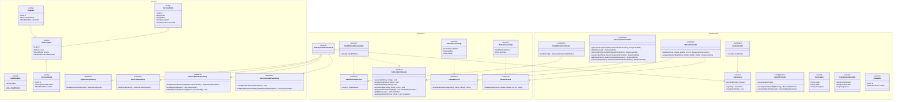

# Itercraft API

Backend REST API — Java 25, Spring Boot 4, architecture DDD (Domain-Driven Design).

## Diagramme de classes

```mermaid
classDiagram
    direction TB

    namespace Domain {
        class HealthStatus {
            <<record>>
            +String status
            +up()$ HealthStatus
        }

        class AppUser {
            <<entity>>
            -UUID id
            -String keycloakSub
            -OffsetDateTime createdAt
        }

        class ServiceEntity {
            <<entity>>
            -UUID id
            -String code
            -String label
            -String description
            -OffsetDateTime createdAt
        }

        class Subscription {
            <<entity>>
            -UUID id
            -AppUser user
            -ServiceEntity service
            -OffsetDateTime subscribedAt
        }

        class ServiceUsage {
            <<entity>>
            -UUID id
            -Subscription subscription
            -OffsetDateTime usedAt
        }

        class AppUserRepository {
            <<interface>>
            +findByKeycloakSub(String) Optional~AppUser~
        }

        class ServiceRepository {
            <<interface>>
            +findByCode(String) Optional~ServiceEntity~
        }

        class SubscriptionRepository {
            <<interface>>
            +findByUserAndService(AppUser, ServiceEntity) Optional~Subscription~
            +findByUser(AppUser) List~Subscription~
            +deleteByUserAndService(AppUser, ServiceEntity) void
        }

        class ServiceUsageRepository {
            <<interface>>
            +countBySubscription(Subscription) long
            +findBySubscriptionOrderByUsedAtDesc(Subscription) List~ServiceUsage~
        }
    }

    namespace Application {
        class HealthCheckService {
            <<interface>>
            +check() HealthStatus
        }

        class HealthCheckServiceImpl {
            <<service>>
            +check() HealthStatus
        }

        class SubscriptionService {
            <<interface>>
            +subscribe(String, String) void
            +unsubscribe(String, String) void
            +addUsage(String, String) void
            +removeUsage(String, String, UUID) void
            +getUserSubscriptions(String) List~UserSubscriptionDto~
            +getAllServices() List~ServiceDto~
            +getUsageHistory(String, String) List~UsageDto~
        }

        class SubscriptionServiceImpl {
            <<service>>
        }

        class ClaudeService {
            <<interface>>
            +analyzeWeatherImage(byte[], String, String) String
        }

        class ClaudeServiceImpl {
            <<service>>
            -RestClient restClient
            -String apiKey
            -String model
        }

        class MeteoService {
            <<interface>>
            +getMapImage(String, double, double, int, int) byte[]
        }

        class MeteoServiceImpl {
            <<service>>
            -RestClient restClient
            -String apiToken
        }
    }

    namespace Infrastructure {
        class HealthCheckController {
            <<controller>>
            +healthcheck() ResponseEntity~HealthStatus~
        }

        class SubscriptionController {
            <<controller>>
            +getUserSubscriptions(BearerTokenAuthentication) ResponseEntity
            +getAllServices() ResponseEntity
            +subscribe(String, BearerTokenAuthentication) ResponseEntity
            +unsubscribe(String, BearerTokenAuthentication) ResponseEntity
            +addUsage(String, BearerTokenAuthentication) ResponseEntity
            +removeUsage(String, UUID, BearerTokenAuthentication) ResponseEntity
        }

        class MeteoController {
            <<controller>>
            +getMap(String, double, double, int, int) ResponseEntity~byte[]~
            +analyzeWeatherMap(String, double, double, String) ResponseEntity
        }

        class SseController {
            <<controller>>
            +events() SseEmitter
        }

        class SseService {
            <<service>>
            -List~SseEmitter~ emitters
            +register() SseEmitter
            +broadcast(String) void
        }

        class SecurityConfig {
            <<configuration>>
            -String allowedOrigins
            +securityFilterChain(HttpSecurity) SecurityFilterChain
            +corsConfigurationSource() CorsConfigurationSource
        }

        class ServiceDto {
            <<record>>
            +String code
            +String label
            +String description
        }

        class UserSubscriptionDto {
            <<record>>
            +String serviceCode
            +String serviceLabel
            +long usageCount
        }

        class UsageDto {
            <<record>>
            +UUID id
            +OffsetDateTime usedAt
        }
    }

    %% Domain relationships
    AppUser "1" --o "*" Subscription
    ServiceEntity "1" --o "*" Subscription
    Subscription "1" --o "*" ServiceUsage

    %% Interface implementations
    HealthCheckServiceImpl ..|> HealthCheckService
    SubscriptionServiceImpl ..|> SubscriptionService
    ClaudeServiceImpl ..|> ClaudeService
    MeteoServiceImpl ..|> MeteoService

    %% Controller dependencies
    HealthCheckController --> HealthCheckService
    SubscriptionController --> SubscriptionService
    MeteoController --> MeteoService
    MeteoController --> ClaudeService
    SseController --> SseService

    %% Service dependencies
    SubscriptionServiceImpl --> AppUserRepository
    SubscriptionServiceImpl --> ServiceRepository
    SubscriptionServiceImpl --> SubscriptionRepository
    SubscriptionServiceImpl --> ServiceUsageRepository
    SubscriptionServiceImpl --> SseService
```
